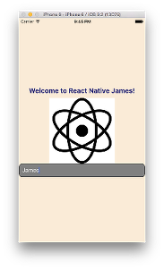

# getting-started-react-native

Getting started with React Native for mobile development



## Presentation Slides

[Click here](https://docs.google.com/presentation/d/1fQMSvoDdO-2ZY1dfsJRbrt3V3pcIKbQPt9OdgpZZL58/edit?usp=sharing)

## Quick Guide (iOS on Mac OS X)

You will need to have Brew and Xcode already installed. Make sure to also have the Chrome browser installed.

```
# Install Node.js
brew install node

# Install React Native Comand Line Tools
npm install -g react-native-cli

# Install Watchman
brew install Watchman

# Install Flow
brew install flow
```

I suggest you use [Atom](https://atom.io/) instead of Sublime due to better syntax highlighting for JavaScript.

Now, you can create a new project:

```
react-native init MyProject

# Go to the project directory and run it
cd MyProject
react-native run-ios
```

The entry point for your app will be in the file `index.ios.js`

## Step-By-Step Guide (Building First App)

[Click here](GUIDE.md)
